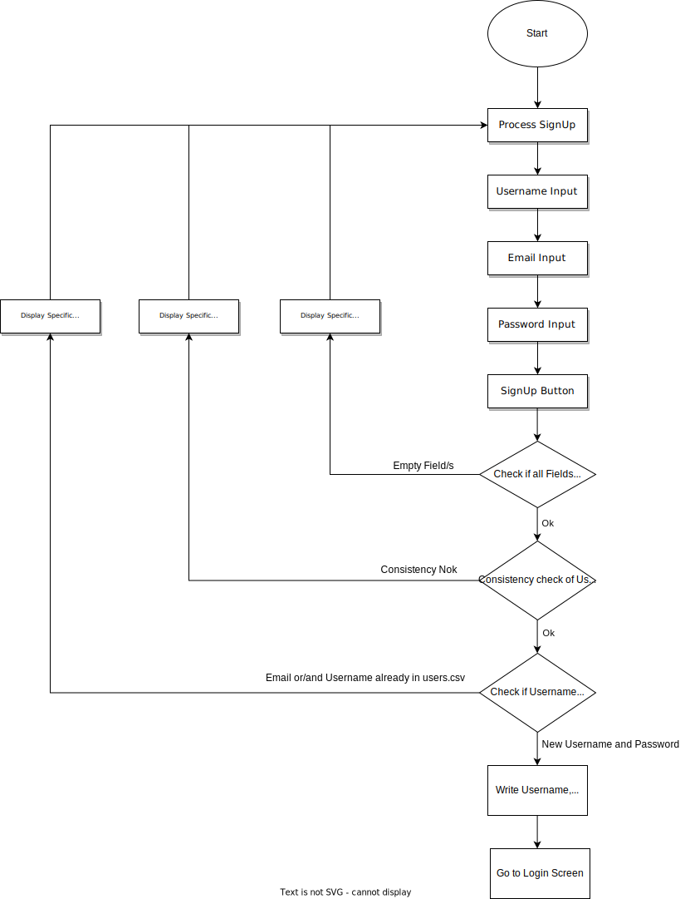
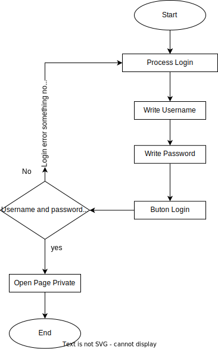
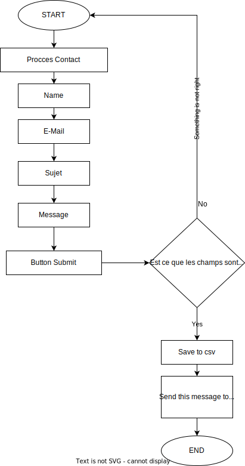

# PHP Restaurant

## Lancer en local

Pour lancer le serveur, il faut réaliser la commande:

> docker-compose up -d

## Afficher en local

Le site est accessible à l'adresse:

> http://127.0.0.1:8999

Le serveur mail de développement (MailDev) est accessible à l'adresse:

> http://127.0.0.1:1080

## Serveur utilisé

Le serveur utilisé est un serveur Apache avec PHP 8.2. Il est lancé grâce à Docker et l'image de base utilisée est PHP: https://hub.docker.com/_/php

## Librariries et dépendances utilisées

- Bootstrap 5.2.3: https://getbootstrap.com/docs/5.2/getting-started/introduction/
- Composer: https://getcomposer.org/ (gestionnaire de dépendances PHP installé via Dockerfile)
- MailDev: https://hub.docker.com/r/maildev/maildev (serveur mail de développement installé via docker)
- PHPMailer: https://github.com/PHPMailer/PHPMailer (dépendance installée avec composer)

## Flow charts

### Flow chart Sign up

### Flow chart Login

### Flow chart Contact

